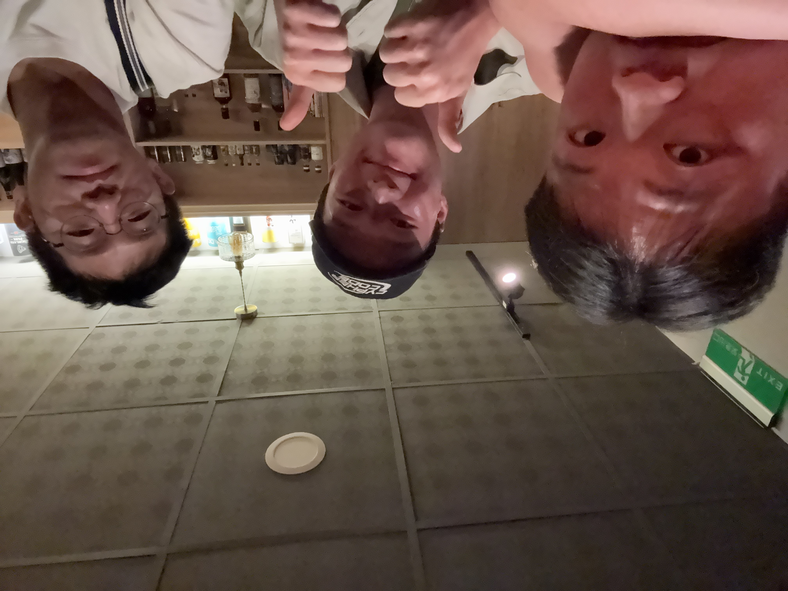
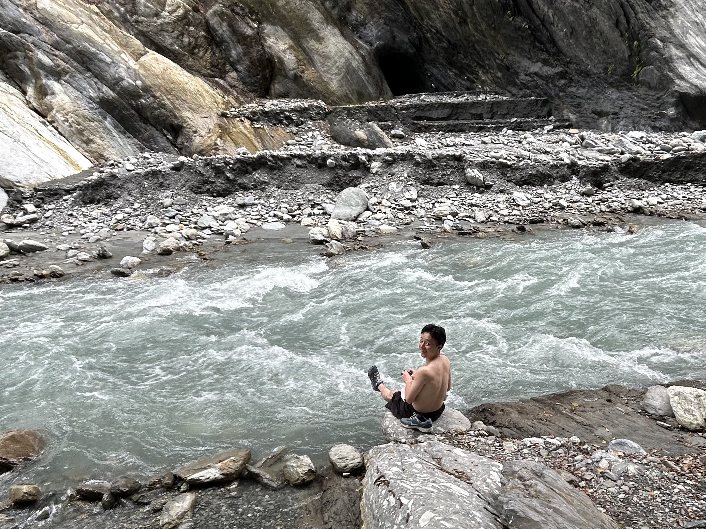

三訪 文山溫泉。

第一次去是被鐵人隊的學長半夜 12 點揪來，還記得當時是摸黑爬下懸崖，夜晚氣溫涼爽帶點寒意，臥倒進溫泉後望向天空，那時地景象大致上可以想像成由懸崖與樹木圍繞而成的畫框，而天空的繁星則為畫本身，從那時我就知道我一定會再回來。

這一次跟著三位好兄弟，非常幸運能在四個月短暫的軍旅身涯遇到一群能夠互相體諒的朋友，陪我去一些腦不生蛋的地方，哈哈。

夜底拾花 Flavor of the Night

兩位的帥照。

 