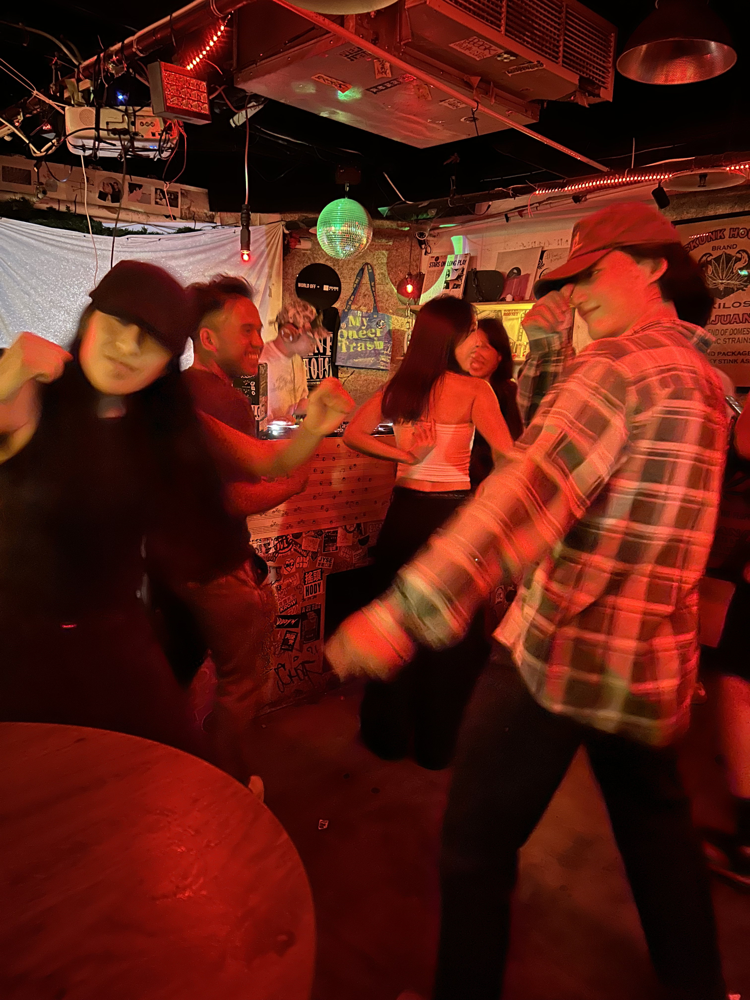

First for house music room, and that's great and enjoyable.

Also meet new friend "Niku" from Nepal, at the night that is my fisrt see "What is dancing by your feeling". 

And when we going to the food store, we talk about "passion", passion sound common for general but actually it is very deeply topic for me. \
Because I'm not sure do I really love my currently job right now ? The motivation for me is "I want to do more than just complete the task" or "I want to doing something and not event just finish it also made it as good as possible" and the "thing" I mention in above not limited in current job, so that is why I'm still very confused right now, and that is my replay haha.

But for Niku she's replay very determined, she always follow her heart, that is very admire for me.
And the more she talked the more feeling I got from the content, she still confused and the funnest part is the thing she confused is completely opposite of me. She asked me if she needed to do the things she doesn't like haha, and my replay is nope ~ Because those things will come to you automatically.
In reality world, those things we don't like it, eventually we will face it at specific time, so choose what you want that is enough, because even you seems like it right now you still need some time for prove it, so just follow your heart.  

So back to house dancing, actually I want to move or swag with rhythm, but for fresh man that is very hard ~ And the amazing part of that is when I keep moving with rhythm, I feeling my brain have the picture about the step, so I start to focus on the rhythm and try to swag it with differnet moving haha.

