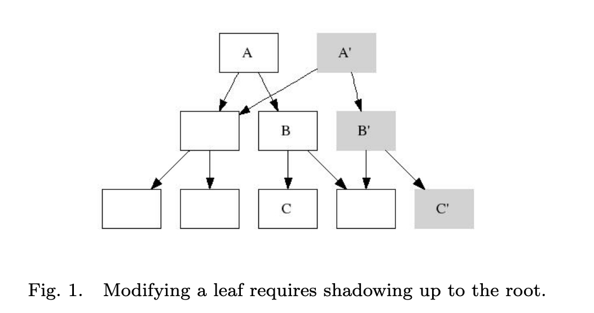
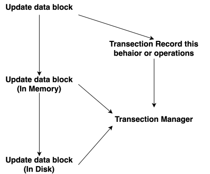
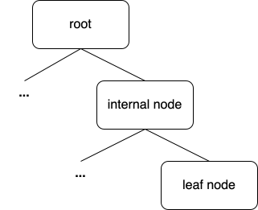
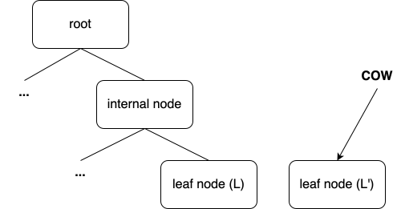
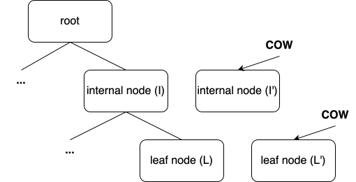
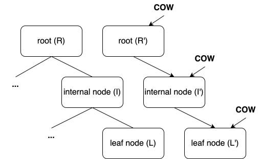
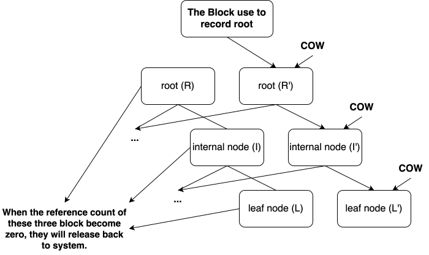

## Brief 

The content just arranges some concepts about **"B-trees, Shadowing, and Clones"** paper.

:::danger
請勿以 "pure B-tree" 的角度思考，或 應該說 btrfs 使用的結構並不能被歸類在 B-tree 或是 B+tree。
:::

:::info
可以用 Database Transactions 的概念思考 “file system 修改資料的流程”。
:::

## Shadowing

> When a page is shadowed its location on disk changes, this creates a need to update (and shadow) the immediate ancestor of the page with the new address. Shadowing propagates up to the file system root. We call this kind of shadowing strict  to distinguish it from other forms of shadowing.

:::warning
該論文提及的 B-tree 中的資料修改， 其 “資料 (data)” 只會存放在 "Lead Node"，而 Internal Node 紀錄協助搜尋的 索引(Index)。

這也是為何任何 改動 會需要由 Leaf Node propagates up to root node 的原因。
:::

### Strict Shadowing & Partial Shadowing ?

根據上述所提到 **“任何改動都需由 Leaf Node 一路 Shadowing 至 root”**，那為何不做 Partial Shadowing ?

:::info
**Partial Shadowing**

場景：
1. New data block is written. 
2. New Leaf Node (shadow) with the updated pointer is written.
3. System crashes before the Leaf Node's parent is updated.

結果:
* The Root pointer still references the old, original B-tree structure. The new Leaf Node is now completely unreachable—it's a floating island of metadata that the file system cannot find or use. The system is permanently inconsistent.

當然並不是 這裡的 **"unreachable"** 我認為並不是 真正意義上的 unreachable，如果 Lead Node(Shadow) 是在已初始化並更新完成的情況下，代表該 BLOCK 已格式化，所以其實是有其他方式可以搜尋的到，只是非常浪費時間。
:::

:::info
**Strict Shadowing**

場景：
1. New data block written.
2. New Leaf Node written.
3. New Parent Node written... all the way up to the Root.
4. System crashes before the Superblock pointer is updated.

結果:
* The Root pointer still references the old, consistent B-tree structure. The entire chain of new shadow pages is safely ignored on reboot. The file system reverts cleanly to the previous state.

其實 Strict Shadowing 要真正安全，還有一項機制要加入 “Transection”，再每一個 stage committed 之前若 system crash，reboot 後由於該 stage 未完成，所以重啟整個操作流程 (可能已被整合進 strict shadowing 中 ？)。
:::

:::warning
Transection 可以用 Interrupt deferred 的方式理解，用 **"極短時間記錄下 花費時間的工作 的 處理資訊”**，再 deferred 給後續的 task or process 執行。

所以 Transection 機制並不是 “completely safe”，只是將 critical section 的區間縮小，讓 crash 發生機率降低。
:::

當然，Partial Shadowing 也可以搭配 Transection，這也就是 **"Journal"**。

所以 Partial Shadowing + Transection 的流程變成這樣:

:::warning
示意圖，實際情景花樣多得很。
:::

1. Logging (The Intent)	The file system first writes a record (a transaction) to a separate, dedicated area of the disk called the Journal. This record explicitly states what changes it is about to make (e.g., "I am moving file X from directory A to directory B, which involves updating pointer P and pointer Q").	
    * Safe Point: If the system crashes here, the Journal contains the list of intended actions.
2. Physical Update	The file system then performs the physical changes on the main part of the disk (the actual metadata update). In a file system using partial shadowing or in-place modification, this is where the disk is temporarily inconsistent.	
    * Unsafe State: If a crash happens here, some pointers might be updated while others are not.
3. Commit (The Safety Marker)	Once all physical updates are complete, the file system writes a special Commit Record to the Journal.
    * Safe Point: The transaction is finalized.

### Why Shadowing need propagate up to root ?  

**Tree structure before modified.**

**When we try to modified Lead node `L`, the operation will follow COW rule, clone the `L` and modified on `L'`.**

**Because the newest data is on the `L'`, that's mean the parant of `L` should also update the block pointer for point to `L'`.**

**So same as previous steps, because the `I` be modified, its parent also update its block pointer, so this operations will propagate up to `root`.**

**And finally, the "new root (`R'`) we be update in some special block", and after each transections be committed, it will remove
old block.**

:::warning
**我第一次看 strict shadowing 疑問**

為何 **"不直接修改 被修改節點的父節點即可？"**

其實並不是不行，而是 現在這種做法 與 snapshots 的關係非常緊密，因為 `Reference Count` 的關係，而這也是 btrfs 的 snapshot 為何能如次快的原因。

善用 strict shadowing 的 I/O 放大帶來的好處。

回到 **"不直接修改 被修改節點的父節點即可？"** 這一問題，當然沒問題，但會犧牲掉 strict shadowing 帶來的效果 (當然 I/O 放大的問題就沒了)。

應該說 只要 **transection operations 分割好**，並沒有不能做的選擇。

所以，回顧上述流程，其實每一步都是一個 transection，一個在 user 眼中簡單的操作由多個 transections 組成，對於設計來說，並沒有強制規定，要切分成多少 transections 來完成，這取決於提供的服務想帶來哪一種效果。
:::

### Summary

Shadowing 在討論的是如何有效的 確保 data integrity。

### 一些有意思的問題

:::warning
**Q1 為何 btrfs 不採用 pure B-tree 實作，而是在 user data 擺放上選擇了 B-plus-tree 的 user data 存放方式 ？**
:::

:::success
目前就我能想得到的原因是， pivot node 最佳化。

internel node 中盡可能塞入幫助搜尋用的資訊，減少層數。
:::

## Clones

總結:

Clones 在討論的是如何善用 B-tree metadata 與 lazy operation(COW) 來 減少空間浪費與快速讓 snapshot 建立。

## Reference

* B-trees, Shadowing, and Clones