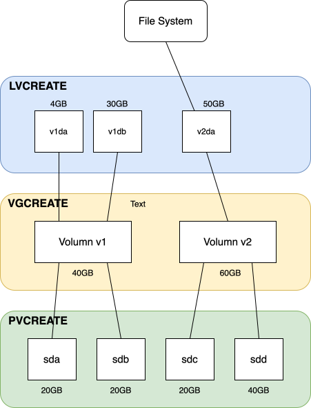
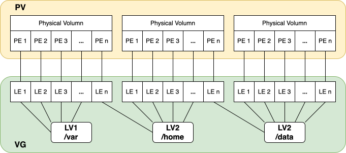

## Brief

Some concept about LVM (Logical Volumn Manager).

## What is LVM ?

> Logical volume management provides a higher-level view of the disk storage on a computer system than the traditional view of disks and partitions. This gives the system administrator much more flexibility in allocating storage to applications and users.

:::warning
Question: 
**Could we use LVM to initialize a hard disk without creating a traditional partition table like "MBR" or "GPT" first ?**

Yes.

* LVM on Whole Disk (/dev/sdb).
* LVM on Single Partition (/dev/sdb1).

About partition table: [link](https://en.wikipedia.org/wiki/GUID_Partition_Table)
:::

## Benefits of Logical Volume Management


### Without LVM

Joe buys a PC with an 8.4 Gigabyte disk on it and installs Linux using the following partitioning system:
```=
/boot    /dev/hda1     10 Megabytes
swap     /dev/hda2    256 Megabytes
/        /dev/hda3      2 Gigabytes
/home    /dev/hda4      6 Gigabytes
```

:::info
**Scenario**：
Sometime later Joe decides that he want to install the latest office suite and desktop UI available but realizes that the root partition isn't large enough.
:::

:::success
**His options for solve this problem**:
1. Reformat the disk, change the partitioning scheme and reinstall.
2. Buy a new disk and figure out some new partitioning scheme that will require the minimum of data movement.
3. Set up a **symlink** farm on `/` pointing to `/home` and install the new software on `/home`
:::

### With LVM

Jane buys a similar PC but uses LVM to divide up the disk in a similar manner:
```=
/boot     /dev/hda1        10 Megabytes
swap      /dev/vg00/swap   256 Megabytes
/         /dev/vg00/root     2 Gigabytes
/home     /dev/vg00/home     6 Gigabytes
```

:::success
When she hits a similar problem as Joe, she can reduce the size of `/home` by a gigabyte and add that space to the root partition.
:::

## Anatomy of LVM

### volume group (VG)

The Volume Group is the highest level abstraction used within the LVM. It gathers together a collection of Logical Volumes and Physical Volumes into one administrative unit.

:::warning
經過 LVM 抽象後的 Volumn.
:::

### physical volume (PV)

A physical volume is typically a hard disk, though it may well just be a device that 'looks' like a hard disk (eg. a software raid device).

:::warning
Physical Storage，資料真正的載體。
:::

### logical volume (LV)

The equivalent of a disk partition in a non-LVM system. The LV is visible as a standard block device; as such the LV can contain a file system (eg. /home).

:::warning
如同上述 **"The equivalent of a disk partition in a non-LVM system."** \
**LV** 是作用在 **VG** 之上的 partition。
:::

### physical extent (PE)

Each physical volume is divided chunks of data, known as physical extents, these extents have the same size as the logical extents for the volume group.

:::warning
The **Physical Extent (PE) is the basic unit of allocation used by LVM to calculate and reserve the total capacity** needed for a Logical Volume (LV) from the Volume Group (VG) pool.
:::

:::danger
PE 是 LVM 中，用來計算儲存空間的基本單位，不等與 Block size。
:::

### logical extent (LE)

Each logical volume is split into chunks of data, known as logical extents. The extent size is the same for all logical volumes in the volume group.

LE 與 PE 成 1:1 映射。

### LV VG PV relation diagram



**Wiki Diagram**


### PE LE relation diagram



:::warning
In above diagram, "the block use to represnet `LE 1` ~ `LE 2`", it use to record the mapping information,
the actually storege block is the block use to represent `PE 1` ~ `PE N`.
:::

## `lvcreate`

:::info
`lvcreate` **"command is not an isolated function; it is a userspace tool that communicates with the kernel-level Device Mapper"** to establish the new virtual volume.
:::

```=
lvcreate -L 10G -n mydata_lv myvg
```

* `lvcreate`: The command used to define and create a new Logical Volume.
* `-L 10G`:	10G	Specifies the exact size of the LV. In this case, 10 Gigabytes (GB). This size will be calculated in Physical Extents (PEs) from the VG pool.
* `-n mydata_lv`: `mydata_lv` Specifies the name for the new Logical Volume.
* `myvg`: `myvg` Specifies the name of the existing Volume Group from which the space will be allocated.

如上述 lvcreate 運作在 user-space 中，作為與使用主互動的介面，而接下來要去看 lvcreate 會使用哪些 system call 將 user 在 user-space 中設定好的 mapping 傳遞給 kernel。

### User-space to  Kernel-space

1. Create Mapping Table
2. `dmsetup` System Call: :bangbang: The lvcreate command uses the dmsetup utility (or a library function that calls the kernel directly) to send this mapping table to the Device Mapper kernel module using a special system call (`ioctl`).
3. Device Creation: The Device Mapper in the kernel receives the mapping table and uses it to instantly create a new virtual block device known internally as a Device Mapper node, such as `/dev/dm-0`.
4. Symlink Creation: Finally, LVM creates the user-friendly symbolic link that you use to access the volume (e.g., `/dev/myvg/mydata_lv`), which points directly to the new Device Mapper node (`/dev/dm-0`).

:::warning
LVM does exactly what GPT and MBR do—it writes its configuration information (metadata) to the back storage using block I/O—but it places that metadata on the Physical Volume (PV), which is usually a partition.
:::

## Device Mapper

:::info
The Server provide Block Virtualization & Mapping (LVM, etc.)
:::

### Relation about LVM & Device Mapper

```=
user-space
            LVM tools
               |
-------------------------------
kernel-space   |
               |
            dm driver
```

* LVM tools are tools we used in user-space for help us talk with `dm`.
* `dm` driver is the actual service provider, and it receive configures from user-space.

### Block Level Cache `dm-cache` tool

:::warning
`dm-cache` is an cache mechanism prvodie by `dm`.

`dm-cache` != `bcache`

`bcache` is another block cache feature provide by kernel.

`dm-cache` 由前綴可知，是由 `dm` 提供的一種 block level cache 機制，而 `bcache` 則單純提供 block level cache.

當然我們也可以使用 LVM 做為 volumn manager，然搭配 `bcache` 使用～
:::

How do I configure `dm-cache` ?

Ans: Configured and managed by LVM utilities (e.g., `lvconvert`).

### Some Questions

:::info
Because LVM provide a functionality that use to abstract multi physical devices to a single virtual device for user, so it must used some "metadata" to record the relationship about block stay in which partition right ?

So my question is: **Is LVM have it own storage space use to store the metadata, that use to management the mapping relation ?**
:::

:::success
The answer is Yes, LVM has its own dedicated storage space and system for storing the metadata it uses to manage the entire service.
:::

## Reference

* [LVM HOWTO](https://tldp.org/HOWTO/LVM-HOWTO/index.html)
* [Enterprise Linux 實戰講座 Logical Volume Manager (一)](https://linux.vbird.org/somepaper/20050321-LVM-1.pdf)
* [Linux LVM: A Comprehensive Guide](https://linuxvox.com/blog/linux-lvm/)
* [LVM(8)](https://www.man7.org/linux/man-pages/man8/lvm.8.html)
