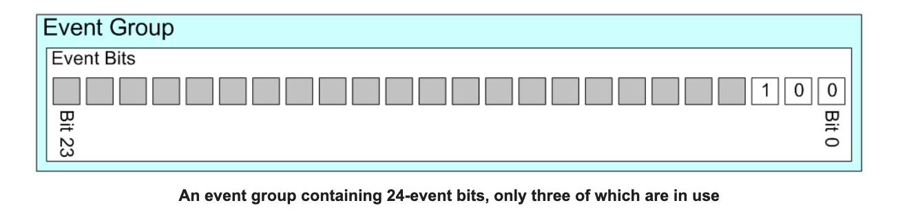

## Breif 

簡單整理一下，FreeRTOS Event-Group 結構 與 Wait-Bit & Set-Bit 機制。

## Structure of Event-Group

```c
typedef struct EventGroupDef_t
{
    EventBits_t uxEventBits;
    List_t xTasksWaitingForBits; /**< List of tasks waiting for a bit to be set. */

    #if ( configUSE_TRACE_FACILITY == 1 )
        UBaseType_t uxEventGroupNumber;
    #endif

    #if ( ( configSUPPORT_STATIC_ALLOCATION == 1 ) && ( configSUPPORT_DYNAMIC_ALLOCATION == 1 ) )
        uint8_t ucStaticallyAllocated; /**< Set to pdTRUE if the event group is statically allocated to ensure no attempt is made to free the memory. */
    #endif
} EventGroup_t;
```

### Members

#### `uxEventBits`

**About `EventBits_t`**

:::warning
* Base on the `TickType_t`
:::

```c
/*
 * The type that holds event bits always matches TickType_t - therefore the
 * number of bits it holds is set by configTICK_TYPE_WIDTH_IN_BITS (16 bits if set to 0,
 * 32 bits if set to 1, 64 bits if set to 2.
 *
 * \defgroup EventBits_t EventBits_t
 * \ingroup EventGroup
 */
typedef TickType_t               EventBits_t;
```



:::info


:::

#### `xTasksWaitingForBits`


## FreeRTOS Tick Type and `configUSE_16_BIT_TICKS`

:::warning
The FreeRTOS **tick type** is governed by the constant **`configUSE_16_BIT_TICKS`**, which determines the underlying size and range of the system's time counter.
:::

### 1. The `TickType_t` Data Type

The core type that represents time in FreeRTOS is **`TickType_t`**. This type holds the value of the system's global tick counter, `xTickCount`, and is used for all time delays and timeouts (e.g., in `vTaskDelay`, `xQueueReceive`).

The size of `TickType_t` is dynamically chosen by FreeRTOS based on the value of `configUSE_16_BIT_TICKS`.

### 2. Significance of `#define configUSE_16_BIT_TICKS 0`

When you set **`configUSE_16_BIT_TICKS`** to **`0`** (which is the recommended default for most modern 32-bit microcontrollers), you instruct FreeRTOS to use a **32-bit unsigned integer** for `TickType_t`.

| Configuration Value | `TickType_t` Size | Maximum Tick Value | Overflow Time (at 1 kHz tick rate) |
| :--- | :--- | :--- | :--- |
| **`0` (Default/Recommended)** | **32-bit** (`uint32_t`) | $4,294,967,295$ | **$\approx 49.7$ days** |
| `1` | 16-bit (`uint16_t`) | $65,535$ | $\approx 65.5$ seconds |

#### Why `0` is Preferred

* **Longer Runtime:** Using a 32-bit tick counter prevents the tick count from overflowing for a much longer period ($\approx 50$ days at a common 1 kHz tick rate). For production systems that run continuously, this is essential.
* **Performance:** On most modern 32-bit microcontrollers (like ARM Cortex-M), operating on a 32-bit integer is the native, fastest operation, meaning there is **no performance penalty** for using the larger type.

### 3. When to Use `1` (16-bit Ticks)

The 16-bit option (`configUSE_16_BIT_TICKS 1`) is only used for very specific scenarios:

* **Memory Constraint:** When running on extremely small 8-bit or 16-bit microcontrollers where RAM is severely limited, and saving 2 bytes per tick-related variable is necessary.
* **Port Optimization:** On some 8-bit or 16-bit architectures, manipulating a 16-bit integer might be intrinsically faster than manipulating a 32-bit integer.


## `xEventGroupSetBits`

:::info
**Function Describition:**


:::

```c
EventBits_t xEventGroupSetBits( EventGroupHandle_t xEventGroup, \
                                const EventBits_t uxBitsToSet )
{
    ListItem_t * pxListItem;
    ListItem_t * pxNext;
    ListItem_t const * pxListEnd;
    List_t const * pxList;
    EventBits_t uxBitsToClear = 0, uxBitsWaitedFor, uxControlBits, uxReturnBits;
    EventGroup_t * pxEventBits = xEventGroup;
    BaseType_t xMatchFound = pdFALSE;

    traceENTER_xEventGroupSetBits( xEventGroup, uxBitsToSet );

    /* Check the user is not attempting to set the bits used by the kernel
        * itself. */
    configASSERT( xEventGroup );
    configASSERT( ( uxBitsToSet & eventEVENT_BITS_CONTROL_BYTES ) == 0 );

    pxList = &( pxEventBits->xTasksWaitingForBits );
    pxListEnd = listGET_END_MARKER( pxList );
    vTaskSuspendAll();
    
    // Please checkout Code Section 1.1
    /* 
     * Main functionality for `xEventGroupSetBits()`.
     */

    ( void ) xTaskResumeAll();

    traceRETURN_xEventGroupSetBits( uxReturnBits );

    return uxReturnBits;
}
```

:::warning
**在 FreeRTOS 中，IPC 機制大多數都會使用 `vTaskSuspendAll()` & `xTaskResumeAll()` 用來保護 Critical Section.**
:::

> **Code Section 1.1**
```c
{
    traceEVENT_GROUP_SET_BITS( xEventGroup, uxBitsToSet );

    pxListItem = listGET_HEAD_ENTRY( pxList );

    /* Set the bits. */
    pxEventBits->uxEventBits |= uxBitsToSet;

    /* See if the new bit value should unblock any tasks. */
    while( pxListItem != pxListEnd )
    {
        pxNext = listGET_NEXT( pxListItem );
        uxBitsWaitedFor = listGET_LIST_ITEM_VALUE( pxListItem );
        xMatchFound = pdFALSE;

        /* Split the bits waited for from the control bits. */
        uxControlBits = uxBitsWaitedFor & eventEVENT_BITS_CONTROL_BYTES;
        uxBitsWaitedFor &= ~eventEVENT_BITS_CONTROL_BYTES;

        if( ( uxControlBits & eventWAIT_FOR_ALL_BITS ) == ( EventBits_t ) 0 )
        {
            /* Just looking for single bit being set. */
            if( ( uxBitsWaitedFor & pxEventBits->uxEventBits ) != ( EventBits_t ) 0 )
            {
                xMatchFound = pdTRUE;
            }
            else
            {
                mtCOVERAGE_TEST_MARKER();
            }
        }
        else if( ( uxBitsWaitedFor & pxEventBits->uxEventBits ) == uxBitsWaitedFor )
        {
            /* All bits are set. */
            xMatchFound = pdTRUE;
        }
        else
        {
            /* Need all bits to be set, but not all the bits were set. */
        }

        if( xMatchFound != pdFALSE )
        {
            /* The bits match.  Should the bits be cleared on exit? */
            if( ( uxControlBits & eventCLEAR_EVENTS_ON_EXIT_BIT ) != ( EventBits_t ) 0 )
            {
                uxBitsToClear |= uxBitsWaitedFor;
            }
            else
            {
                mtCOVERAGE_TEST_MARKER();
            }

            /* Store the actual event flag value in the task's event list
                * item before removing the task from the event list.  The
                * eventUNBLOCKED_DUE_TO_BIT_SET bit is set so the task knows
                * that is was unblocked due to its required bits matching, rather
                * than because it timed out. */
            vTaskRemoveFromUnorderedEventList( pxListItem, pxEventBits->uxEventBits | eventUNBLOCKED_DUE_TO_BIT_SET );
        }

        /* Move onto the next list item.  Note pxListItem->pxNext is not
            * used here as the list item may have been removed from the event list
            * and inserted into the ready/pending reading list. */
        pxListItem = pxNext;
    }

    /* Clear any bits that matched when the eventCLEAR_EVENTS_ON_EXIT_BIT
        * bit was set in the control word. */
    pxEventBits->uxEventBits &= ~uxBitsToClear;

    /* Snapshot resulting bits. */
    uxReturnBits = pxEventBits->uxEventBits;
}
```