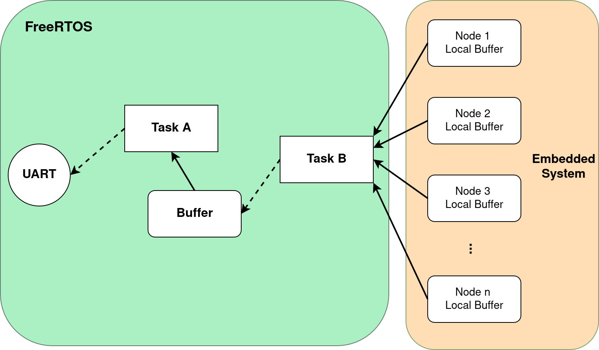
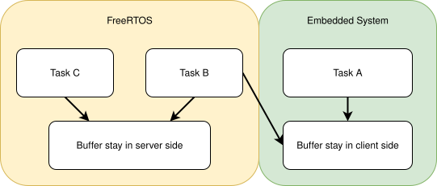
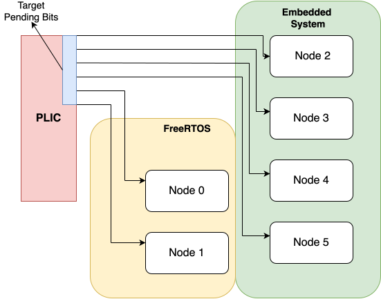

## Brief 

The content talk about **"Building a UART Log System with FreeRTOS on Multi-core single UART env"**.

## System Structure



* Task A: A FreeRTOS Task, that use to fetch log from "Buffer" and push log in UART TXFIFO.
* Task B: A FreeRTOS Task, that use to receive log from Node buffer.
* Node (`1 ~ n`) Buffer: In the core that running embedded process.
* Buffer: In the core that running FreeRTOS.

## Data Structure We Would Use

Here will talk about those "structures" used in log system.

Basically, we could arrange them in below:

* log_t: A structure use to abstract a log, it member is an `uint_8` array and its size define by LOG_MESSAGE_LIMIT`, we will call it as "block" in below.
* ring buffer: An array its type is `log_t`.

```c
typedef struct __log {
    uint8_t buf[LOG_MESSAGE_LIMIT];
} log_t;
```

```c
typedef struct __logCtl {
    volatile uint64_t rIndex;
    volatile uint64_t wIndex;
    log_t logs[LOGCLIENT_BUF_SIZE];
} logCtl_t;

```

### Unbounded Indexing Ring Buffer

Here will talk about the behavior of ring buffer.

Basically, this ring buffer behavior like  **"queue"**, it support `PUSH` & `POP`, and the logs they follow the FIFO rule when we operate it by `PUSH` & `POP`.

As you can see above, the ring buffer mentain by two Index `rIndex` & `wIndex` as:

* Read index for `rIndex`. (Consumer)
* Write index for `wIndex`. (Producer)


:::warning
:bangbang: **Here we need talk about a concept used in ring buffer:**

**"Unbounded Indexing"**
:::

### Unbounded Index ?



As you can see above diagram, the buffer use to store log they could be arrange in below:

:::warning
* **Buffer Stay In Green Background:** It would be access by "the task that use for push log in client side(**Task A**)", and "the task that use for server side for receive log from client buffer in server buffer(**Task B**)". 
    * :bangbang: **The two tasks stay in different cores. (Situation A)**
* **Buffer Stay In Brown Background:** It would be access by "the task that use to receive log from client buffer in server buffer(**Task B**)", and "the task that use to fetch log from server log buffer and put the characters in log block to UART TXFIFO(**Task C**)". 
    * :bangbang: **The two tasks stay in same core, but two tasks that management by FreeRTOS Scheduler rule. (Situation B)**
:::

Back to traditional ring buffer, it still use two index mentain read & write behavior.

**And right now is the key point pay attaintion :bangbang:**

:::warning
The difference between **Unbounded Indexing** & **Traditional Way** is:

* **How they "handle the condition when the read or write index that meet the limit size of array."**
* **Unbounded Indexing don't need additional variable for distinct the "Empty or Full" state.**
:::

#### For Tradition

It use a `if-else` condition or `%` moduler for check and update the "index", yes a lot of way...

```c
if (wIndex >= SIZE_OF_ARRAY) {
    wIndex = 0;
}
```

```c
/*
 * If your array size is alignment with power of 2.
 */
if (wIndex & SIZE)
    wIndex = 0;
```

```c
wIndex %= SIZE_OF_ARRAY;
```

:::warning
But in our Situations (A & B) this have a big problem, because we need a **"Lock"** for protect the variable that would be **"modify"** by two different task or thread etc...

And that is a worst way to handle it, because the lock it would break a lot of accelerate features, that used in processor.

So we use Unbounded Indexing to handle it.
:::

:::danger
In Traditional Way for ring buffer, we usually need additional variable for distinct the condition about **"Buffer full" & "Buffer empty"** 

For example:

```c
struct ring_buf {
    <type> wIndex;
    <type> rIndex;
    bool isBufFull;
}
```

**And that is the reason, why we need a lock !!**

**`isBufFull` it would be access by "Consumer" & "Producer".**

**Because the Empty case and Full case are both possible occured in Consumer & Producer behavior,
so the `isBufFull` it would be load to different core register and update it and finally write
back to the memory, so if we don't use lock protect it the race condition occued.**

----

Or **we may use another way to avoid above situation.**

We could use like below:

* `wIndex == rIndex` : For Empty.
* `(wIndex + 1) % BUF_SIZE == rIndex` : For Full.

**But it will waste a Log Block in a ring buffer structure !!**

**And this is a big cost in our implementation, becuase we use a lot of buffer for store logs.**
::: 

#### For Unbounded Indexing

:::info
**The idea of unbounded indexing is the "read & write index" didn't move back to start index(usually zero) when they reach the limit of ring buffer.**

**Replaced, they keep increase until the limit of `<type>` of read & write index.**
:::

**Adventage:**

* We don't need use lock for protect `wIndex` & `rIndex`.
    * `wIndex` only update by "Producer" and "Consumer" only could read it,
      so the worst case is Consumer read old value.
    * `rIndex` same as `wIndex`, only update by "Consumer" and read by "Producer".
* We don't need another variable for distinct "Full & Empty" statement.
* We could use all space in ring buffer.

**Disadventage:**

* We need use `%` (moduler) each time, when we need access the log block in ring buffer.
* Is limit depend on the type of value we used.


## How client side notify server side receive log ?

In here we use:

* client side: For represent a Task running on the Embedded env.
* server side: For represent a Task running on the FreeRTOS.

### PLIC & Process relationship

:::info
In RISC-V ISA, the Peripheral interrupt is manage by PLIC (Platform-level interrupt controller), \
and it provide programer configurable enable bit(1024 source bit for each target), so we could \
mapping a bit to crossponding core for represnet the log receive signal.
:::



#### Interrupt Handler for log system

Right now, we have the way for signal to log server for receive log from client by interrupt. \
So we need a crossponding ISR (Interrupt Service Routine) for service those interrupts.

:::warning
**In ISR the only things we need process it "Notify the log Receive Task" that's all.** \
**The work about "transfer log from client buffer to server buffer" will defer to FreeRTOS Task.**
:::

```c
void logSysHandler(uint32_t hart) {
    hart -= OFFSET;
    logServ->bitmap |= (0x1 << hart);

    BaseType_t xHigherPriorityTaskWoken = pdFALSE;
    vTaskNotifyGiveFromISR(xTaskLogServ, &xHigherPriorityTaskWoken);
    portYIELD_FROM_ISR(xHigherPriorityTaskWoken);
}
```

### Task Notification

:::info
**Task Notify is a powerful mechanism provide by FreeRTOS, let us could build event driven system.**
:::

Above we talk about **how different cores communicate with each other for reveice logs.** \
For here, we will talk about **how different task communicate with each other for receive logs.**

:::warning
It is very simple, by FreeRTOS notify mechanism.

Because the log server is a FreeRTSOS Task and when it finished its routine will call 'ulTaskNotifyTake(pdTRUE, portMAX_DELAY)' and this function will change the task state to **"BLOCKED"** and it means this  task is waiting for some event occured, so the Task will release CPU by itself and FreeRTOS scheduler will remove task's TCB from ready list and insert it to blocked list.
:::

## Log Push Function

### Code for log function task running on the different processor (Code A)

In the code below, we skip some code that are not we want talk about here.

```c
int logPush(const char *format, ...) {
    uint64_t rIndex, wIndex;

    rIndex = logBuf->rIndex;
    wIndex = logBuf->wIndex;

    if (wIndex - rIndex == LOGCLIENT_BUF_SIZE)
        return -1;

    /*
     * Log Building Part skip.
     */

    /*
     * Copy Log from buf to client buffer skip.
     */

    wIndex ++;
    logBuf->wIndex = wIndex;

    if (wIndex - rIndex >= LOGCLIENT_THRESHOLD) {
        PLIC_log_interrupt(HART_ID);
    }
    return 1;
}
```


### Code for log push function running on the same processor with log receive task (Code B)

```c
int logPush(const char *format, ...) {
    uint64_t rIndex, wIndex;

    /*
     * Log Building Part skip.
     */

    rIndex = logBuf->rIndex;

    timerDisable();
    wIndex = logBuf->wIndex;
    if (wIndex - rIndex == LOGCLIENT_BUF_SIZE) {
        timerEnable();
        return -1;
    }
    /*
     * Copy Log from buf to client buffer skip.
     */

    wIndex ++;
    logBuf->wIndex = wIndex;
    timerEnable();

    if (wIndex - rIndex >= LOGCLIENT_THRESHOLD) {
        logServ->bitmap |= (0x1 << 1);
        xTaskNotifyGive(xTaskLogServ);
    }
    return 1;
}
```

:::danger
That have a big difference about Code A & Code B.

1. How they notify log server for receive log.
2. In "Code A" we don't need protect `wIndex` and the section about log copy, but in "Code B" \
   we need it (I will explain in below).
:::

### Why we need disable timer interrput(`MTIE` bit in `MIE` register) ?

:::warning
**On the FreeRTOS that have a lot of "Task share a CPU", so we don't know which time the task \
it would be swap out from CPU, and if today we have more than 2 task and they have same priority, 
the race condition occured:**

* For Tasks that calling Log Push function: In this situation, that will lead `wIndex` unstable \
  because if Task A interrupted by timer interrupt before it write back update of `wIndex` to \
  memory and Task B try to read `wIndex`, we will miss a log in this situation.
:::

#### So why is disable timer interrupt ?

Because the purpose it we must make sure when the task execute in critical section, it could be \
finished all the process in critical section, and we know the `wIndex` only be update by Task calling \
the log push function, so we don't disalbe Machine Mode Global Interrupt in `mstatus` register.

In FreeRTOS scheduler is trigger by timer interrupt, so if we want a Task could be completely finished \
some code section, we could achieve by diable timer interrupt.  

:::danger
**You may ask way don't we just protect the `wIndex`, so this way could reduce the code execute in \
critial section.**

I will explain this part at **Log Receive Task & Uart Task** section.
:::

## Log Receive Task & Uart Task (Running on the FreeRTOS)

Here we talk about How to receive log & put log in UART TXFIFO.


### Log Receive Task

When the server processor receive an interrupt from client processor, it will turn up the crossponding \
bit(Each bit use to represent a processor), and send notify to `logReceiveTask()`.

As you can see, once `logReceiveTask()` started, it will keep fetch logs from client, and after that \
it swap out itself go to "BLOCKED" state waiting notify.

```c
void logReceiveTask(void *pvParameters) {
    uint64_t *from, *to;
    uint64_t sWindex, sRindex;
    uint64_t cWindex, cRindex;
    uint32_t mask;
    UBaseType_t uxCurrentPriority;

    for (;;) {
        if (logServ->bitmap == 0) {
WAIT_BUFFER_EMPTY:
            ulTaskNotifyTake(pdTRUE, portMAX_DELAY);
        }

        mask = 0x1;
        for (int i = 0; i < LOGSERV_MAX_CORES; i ++, mask <<= 1) {
            if (!(logServ->bitmap & mask))
                continue;
            
            /*
             * In below we have sWindex & sRindex, the 's' for server's index.
             * cWindex & cRindex, the 'c' for client's index.
             */
            sWindex = logServ->wIndex;
            sRindex = logServ->rIndex;

            if (LOGSERV_BUF_FULL) {
                uxCurrentPriority = uxTaskPriorityGet(NULL);
                vTaskPrioritySet(xTaskUart, uxCurrentPriority + 1);
                goto WAIT_BUFFER_EMPTY;
            }
            
            cWindex = coresLogCtl[i]->wIndex;
            cRindex = coresLogCtl[i]->rIndex;
            for (; cRindex < cWindex && !LOGSERV_BUF_FULL;) {
                from = CASTING_UINT64P(&(coresLogCtl[i]->logs[cRindex % LOGCLIENT_BUF_SIZE]));
                to = CASTING_UINT64P(&(logServ->logs[sWindex % LOGSERV_BUF_SIZE]));

                /*
                 * Log Copy from client buffer to server buffer, skip.
                 */

                cRindex ++;
                sWindex ++;
            }

            coresLogCtl[i]->rIndex = cRindex;
            logServ->wIndex = sWindex;
            logServ->bitmap &= ~mask;
        }

        /*
         * Set DLAB to zero and Enable TXFIFO Interrupt.
         */
        UART_CTLR->IER |= IER_TEI_MASK;
    }

    for (;;);
}
```

#### Have any critical sections ?

No, because we can promise the objects access by `logReceiveTask()`:

* If the object is control under `logReceiveTask()`, only itself could be modify the member in object.
* If the object is control by other, `logReceiveTask()` only read information from that.

### UART TASK

```c
void uartTxTask(void *pvParameters) {
    uint64_t sRindex, sWindex;
    static char *buf = NULL;
    int index;
    UBaseType_t uxCurrentPriority, logRecvPri;

    for (;;) {
UARTTX_WAIT_TXFIFO_HAVE_SPACE:
        index = 0;
        ulTaskNotifyTake(pdTRUE, portMAX_DELAY);

        // Disable TXFIFO empty Interrupt.
        UART_CTLR->IER &= ~(IER_TEI_MASK);

        // Section A start
        if (!buf) {
UARTTX_READ_NEXT_LOG:
            sWindex = logServ->wIndex;
            sRindex = logServ->rIndex;
            buf = CASTING_CHARP(&LOG);
        }
        // Section A end

        // Section B start
        for (; index < TXFIFO_SIZE; index ++) {
            UART_CTLR->THR = *buf;
            if (*buf == END_SYMBOL)
                break;
            buf ++;
        }
        // Section B end

        // Section C start
        if (*buf != END_SYMBOL) {
            UART_CTLR->IER |= IER_TEI_MASK;
            goto UARTTX_WAIT_TXFIFO_HAVE_SPACE;
        }
        // Section C end

        sRindex ++;
        logServ->rIndex = sRindex;

        // Section D start
        if (IS_LOGSERV_HAVELOG && index != TXFIFO_SIZE) {
            goto UARTTX_READ_NEXT_LOG;
        }
        // Section D end
        
        // Section E start
        if (!IS_LOGSERV_HAVELOG) {
            UART_CTLR->IER &= ~(IER_TEI_MASK);
            buf = NULL;
            uxCurrentPriority = uxTaskPriorityGet(NULL);
            logRecvPri = uxTaskPriorityGet(xTaskLogServ);
            if (uxCurrentPriority > logRecvPri)
                vTaskPrioritySet(NULL, logRecvPri);
            goto UARTTX_WAIT_TXFIFO_HAVE_SPACE;
        }
        // Section E end

        // Section F start
        if (*buf == END_SYMBOL) {
            buf = NULL;
            UART_CTLR->IER |= IER_TEI_MASK;
        }
        // Section F end
    }

    for (;;);
}
```

:::danger
In [**Why we need disable timer interrput(`MTIE` bit in `MIE` register) ?**](#why-we-need-disable-timer-interrputmtie-bit-in-mie-register-) part, we have a question:

* About is the log copy should include in critical section ?

Checking **"Section B in UART TASK function"** this part use to copy log from log block once a character,and accroding to the log structure design, we need a **"special character"** for represent the end of log(Here we used `END_SYMBOL` macro as the end symbol), **and that is the reason we need protected log copy in client part, because we need make sure the log completely copied in server side and when UART TASK read it, the log block is completely.**
:::