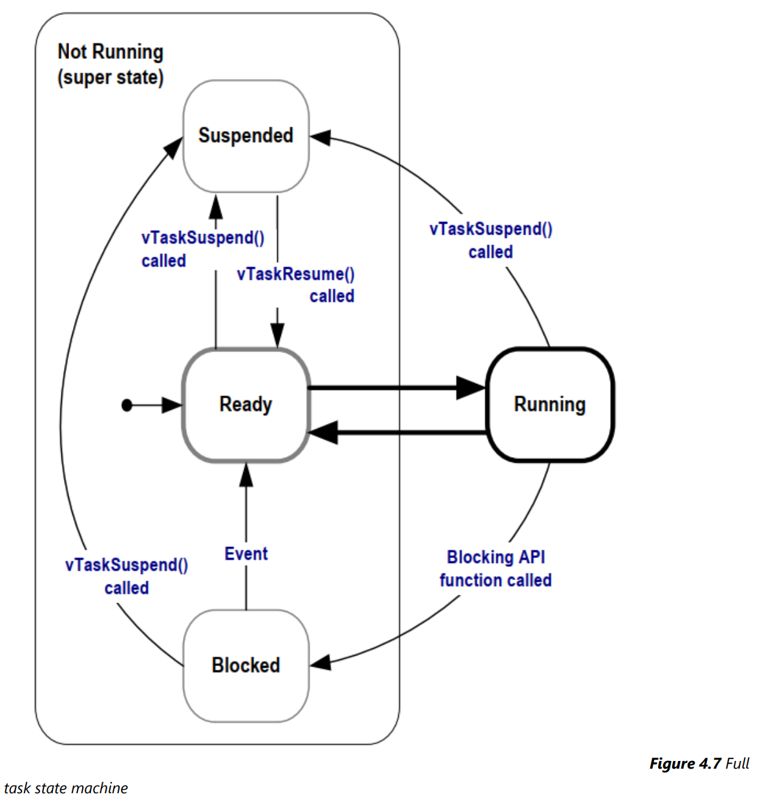

## Breif

整理 FreeRTOS TCB(Task Control Block) 如何被 FreeRTOS Schedular 管理。

## Task Priorities

### Range of Priority

:::warning
The application-defined `configMAX_PRIORITIES` **"compile-time configuration constant"** sets the number of available priorities.

So valid priorities range from `0` to `(configMAX_PRIORITIES – 1)`.
:::

### The Way to set or modify Task Priority

* `uxPriority` parameter in `xTaskCreate()` Function.
* `vTaskPrioritySet()` for changes a task's priority after its creation.

### Scheduling Policy

:::warning
* **Preemptive:** If a task with a higher priority becomes ready (e.g., due to an interrupt, a task notification, or a semaphore release), the scheduler immediately interrupts the currently running, lower-priority task and switches context to the higher-priority task.
* **Priority-Based:** Tasks are assigned a priority level. The scheduler's fundamental rule is: 
    * :bangbang:  **"the highest-priority task that is ready to run will always be the task that is running."**
:::

### Summary

FreeRTOS 透過 `xTaskCreate()` 建立 Task，且該 Task 的 Priority 必須在一建立時決定好。

在制定 Task Priority 時，需謹慎考慮該 Task 使用場景，因為擁有 Higher Priority 的 Task 除非進入 Blocked State 否則將會持續佔有 CPU。

## Task State

> To make these tasks useful, they must be re-written to be event-driven. An event-driven task only has work (processing) to perform after an event triggers it and cannot enter the Running state before that time. The scheduler always selects the highest priority task that can run. If a high-priority task cannot be selected because it is waiting for an event, the scheduler must, instead, select a lower-priority task that can run. Therefore, writing event-driven tasks means tasks can be created at different priorities without the highest priority tasks starving all the lower priority tasks of processing time.

其實在使用過 `Notify` 與一些 FreeRTOS 的 IPC Mechanism 後，就覺得這些 IPC 在設計初時，應該是希望使用者在撰寫時，是使用 **Event-Driven** 的思維。

:::warning
**High Priority Task always trigger by some event, and after finished it directly go to the block state wait event again.**
:::

### The Blocked State

> **A task waiting for an event is said to be in the 'Blocked' state, a sub-state of the Not Running state.**

:::warning
Tasks can enter the Blocked state to wait for two different types of events:

* **Temporal (time-related) events**: For example, a task may enter the Blocked state to wait for 10 milliseconds to pass.
* **Synchronization events**: These events originate from another task or interrupt. For example, a task may enter the Blocked state to wait for data to arrive on a queue. Synchronization events cover a broad range of event types.
    * FreeRTOS queues, binary semaphores, counting semaphores, mutexes, recursive mutexes, event groups, stream buffers, message buffers, and direct to task notifications can all create synchronization events. 
:::

### The Suspended State

Tasks in the Suspended state are not available to the scheduler.

The only way to enter the Suspended state is through a call to the vTaskSuspend() API function, and the only way out is through a call to the vTaskResume() or xTaskResumeFromISR() API functions. 

### The Ready State

Tasks that are in the Not Running state and are not Blocked or Suspended are said to be in the Ready state.

### State Transition Diagram

### Summary

FreeRTOS 的 Task State 相對 Linux kernel 單純好幾個檔次，個人認為是 FreeRTOS 在設計之初，是被設計來解決 可透過 “有限狀態機” 表示的問題，且這些問題是被侷限在問題都已確定的情況下，所以才能夠將設計做到最簡化。