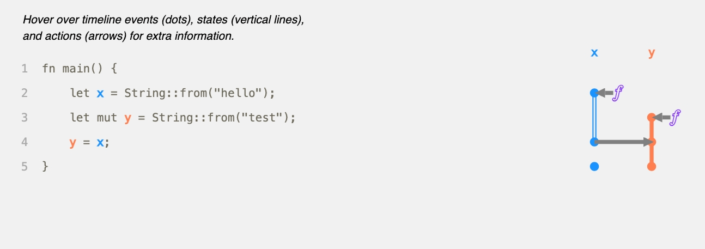

## Brief

The Note record my understand for Rust Ownership.

## What is Ownership ?

> Ownership is a set of rules that govern how a Rust program manages memory. \
> 摘錄自 Rust Book Chapter 4.1

**記憶體管理策略:**
* 主動 allocate & free memory. 例如 C 語言。
* Garbage Collection. 例如 Go 語言。

Rust 不採用上述兩種方式。

:::warning
Rust 透過 Compile time 去檢查 “物件” 的 ownership。

目前為止可以知道:
* **Ownership is a compiler-time mechanism, that use to memory management.**
* **Rust provide series of rules for Ownership.**
:::

## Ownership Rules

:::danger
**Before dive in Ownership, we must keep below three ideas in mind.**

* Each value in Rust has an owner.
* There can only be one owner at a time.
* When the owner goes out of scope, the value will be dropped.
:::


## Variable Scope

```rust
{                      // s is not valid here, since it's not yet declared
    let s = "hello";   // s is valid from this point forward

    // do stuff with s
}                      // this scope is now over, and s is no longer valid
```

這部分跟就如同 C 語言將 local variable 放在 stack 中，當 local variable 所在的 scope 結束時，其生命也隨之結束。 

## The String Type

> We want to look at data that is stored on the heap and explore how Rust knows when to clean up that data, and the String type is a great example. \
> 摘錄自 Rust Book Chapter 4.1

如同上述 primitive type 由於形態大小已知，所以在空間管理方面相比 `String` 單純，這也是為何 Rust Book 以 `String` 為例，介紹 Ownership 如何管理從 heap 分配的物件。


## Memory & Allocation

> In the case of a string literal, we know the contents at compile time, so the text is hardcoded directly into the final executable. This is why string literals are fast and efficient. But these properties only come from the string literal’s immutability. Unfortunately, we can’t put a blob of memory into the binary for each piece of text whose size is unknown at compile time and whose size might change while running the program. \
> 摘錄自 Rust Book Chapter 4.1

在 Bare-metal 環境中撰寫 C，我們通常需要自行撰寫 Link-script 用來告知 linker **Input sections 會被放到 Executable 中的哪些 sections**， 或是 **哪些 objects 需要放到哪一個 section**。

如果熟習 Assembly 與 C compiler attributes，我們可以知道所有的物件(primitive type)，就是由 compiler 與根據語言規範將其放置至相應 section，例如：
* 初始化的全域變數會被放置在 `.data` section
* 未初始化的全域變數會被放置在 `.bss` section
* 非全域變數則不需要空間存放 (因為在執行時期就會放置在 stack 中)

或是使用者透過 compiler attributes 去要求 compiler 將特定 object 放置至相應的 section (當然這需要搭配 Link-script 分配相應 section)。

回到 Rust 亦是如此，所謂的 "immutable variable" 可能就存放在 read only section，而不是透過 heap management（這裡取決於 Rust compiler 的實作策略）。

```rust
{
    let s = String::from("hello"); // s is valid from this point forward

    // do stuff with s
}                                  // this scope is now over, and s is no
                                   // longer valid
```

上述範例，就是透過 `{}` 判斷 object 是否需要被 “釋放”，當離開 scope 時，`s` 所指向的物件沒有 owner 了，這時 Rust compiler 就會自動加上 `drop` call 將 s 所指向的向 heap allocate 的物件釋放。

### Variables and Data Interacting with Move

:::warning
Multiple variables can interact with the same data in different ways in Rust.
:::

在 Rust 中， "`=`" asigne operator 會根據不同 data type 有不同含義。

大致上分為：
* Copy (In stack)
* Move (In heap)

**Primitive type**

透過 copy mechanism，`x` & `y` 個別只向 “獨立” 物件，將 `x` 所指向的物 “複製(在 stack 分配空間)” 給 `y`。

```rust
let x = 5;
let y = x;
```

**Complex type**

透過 move mechanism， 物件的 ownership 會隨著，被變數存取的順序流動。

```rust
let s1 = String::from("hello");
let s2 = s1;
```

下圖 左邊物件存放在 stack 右邊物件存放在 heap


:::warning
:bangbang: **以下條件 只有當物件形態為 非 primitive type 時成立。**

```rust
let s2 = s1;
```
在 Rust 中，當有相同變數名稱 且 這些變數名稱指向相同物件時，Rust 會透過 "Move" 將 物件的 Ownership 轉移，並 invalid 舊的變數名稱。
:::


**Complex type**
```rust
let s1 = String::from("hello");
let s2 = s1;

println!("s1: {}", s1); // This will lead compiler error, because `s1` become invalid.
```

## Example


### move_assignment

```rust
fn main() { 
    let x = String::from("hello"); 
    let mut y = String::from("test"); 
    y = x; 

    y.push_str("_QWER");

    println!("{}", y);
}   
```



:::warning
**Ownership 一但轉移，該物件的存取權限會由新的變數決定。**

以上述程式碼為例，`y` 擁有 `mut` 這一 attribute，第四行將 `x` 所指向的物件的 ownership move 至 `y`。
這意味的原本由 `x` 管理的物件，在第四行後透過 `y` 變數的規則(`mut`)來管理。
:::


## Borrow 


* Many immutable borrows (&T) at once (Aliasing, but no mutation).
* Exactly one mutable borrow (&mut T) at once (Mutation, but no aliasing).

:::warning
:bangbang: **You cannot have both at the same time.**
:::

以下透過一些範例，說明 What is **You cannot have both at the same time.** ?

### Example

**Interface:**
```rust
pub fn search(&mut self, tid: u32) -> Option<&mut Task>;
```

**Code:**
```rust
// Error !!!
if let Some(root) = manager.search(id_root) {
    manager.add_sub_task(root, Task::new(id_sub, "Sub".to_string()));
}      
```

:::warning
由於在 `if let Some(root) = manager.search(id_root)` 這一部分，`search()` 會回傳一個由 `Option` 包裝的 `&mut` 給 root，然後我們在 root 的 lifetime 還有效的範圍內:
```rust
if let Some(root) = manager.search(id_root) {
    // 有效範圍
}   
```
試圖將已被以 `&mut` 形式 borrow 的物件，再以 `&mut` 形式 borrow 至另一個 scope。
:::

:::success
所以 **You cannot have both at the same time.**

翻成中文就是，Rust 只允許同一個 scope 中出現以下場景(擇一):
* Many immutable borrows (`&T`) at once (Aliasing, but no mutation).
* Exactly one mutable borrow (`&mut T`) at once (Mutation, but no aliasing).
:::


## Summary

* **primitive type 由於 copy 成本低，所以在 assign 發生時，採用 copy.**
* **complex type(like: string, structure) 複製成本高，所以在 assign 發生時，採用 ownership 轉移機制(move or borrow)。**
* **Object 的存取權限，取決於當前擁有該 object 的 ownership 的 variable(Modify keyword: `mut`, `const`)。**
